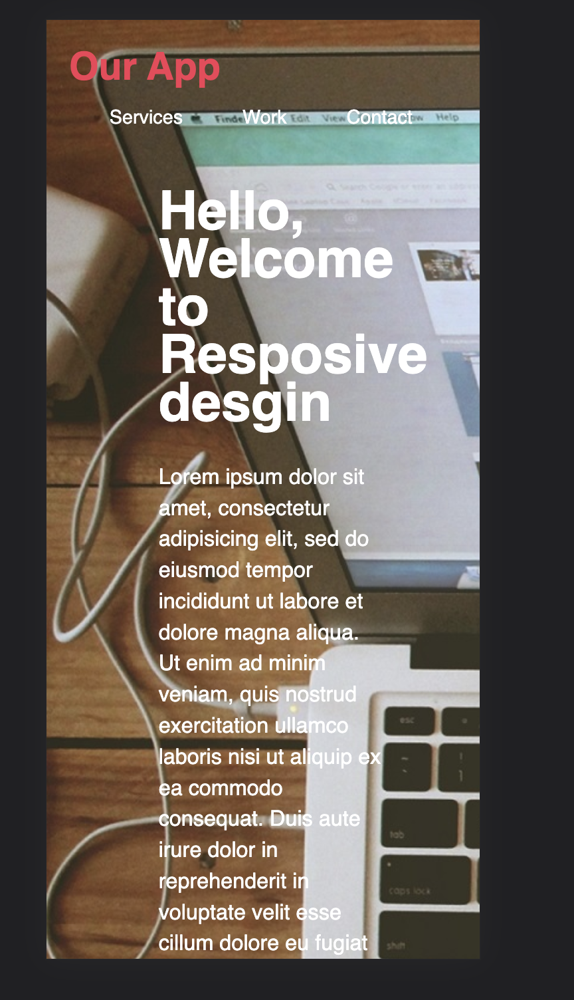
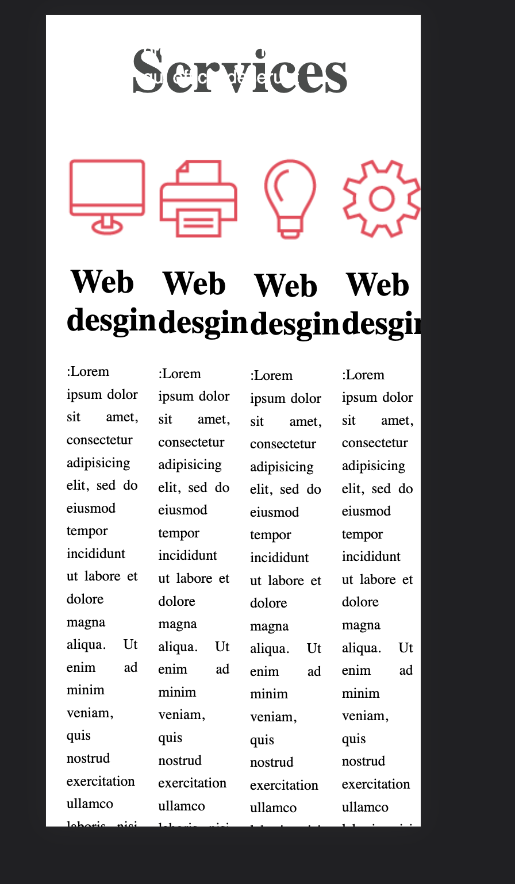
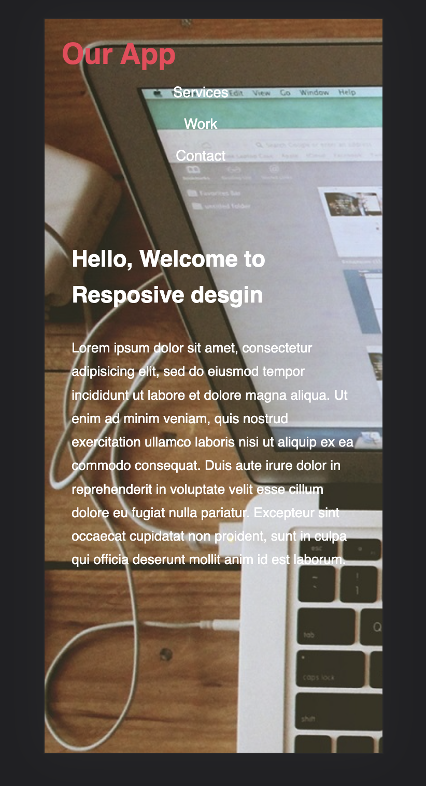
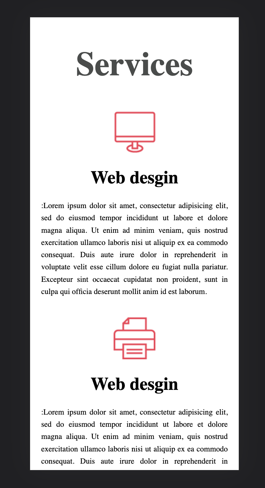
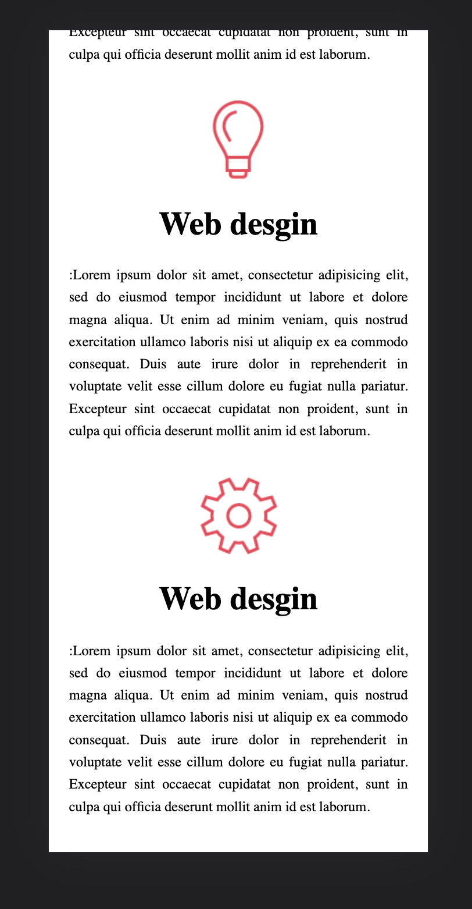

# Responsive Web Design HW

Your client has an awesome website that they want to make responsive. However, they don't want to modify their existing HTML, so they've asked you to only change the stylesheet.

Notes:

- **DO NOT MODIFY THE HTML**
- Look up `@mdeia for mobile` (css).
- Look up `@media for tablet` (css).

### The website look like this before add @mdeia when they open it on mobile 

### They want to be responsive as below images

